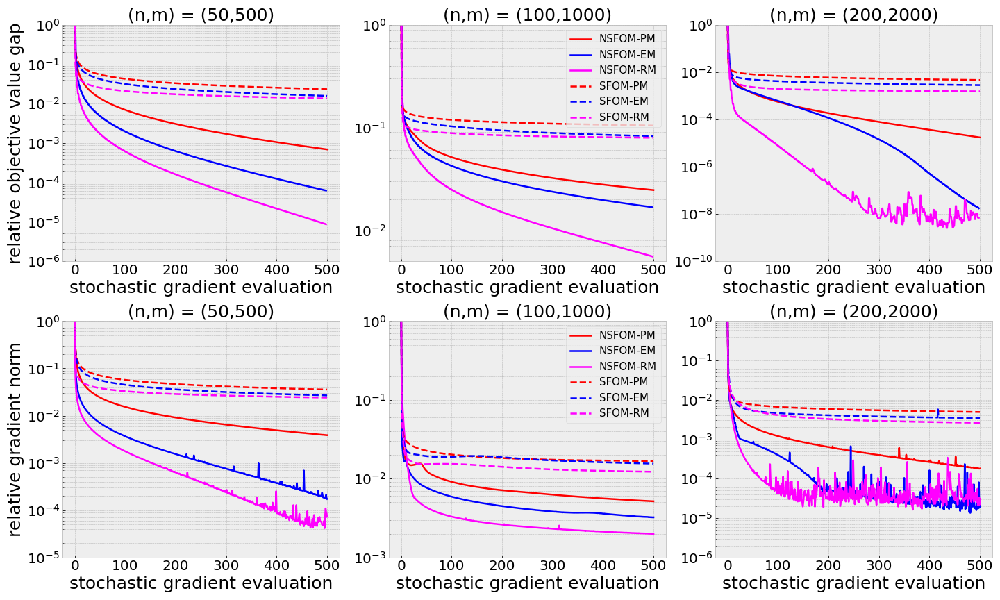
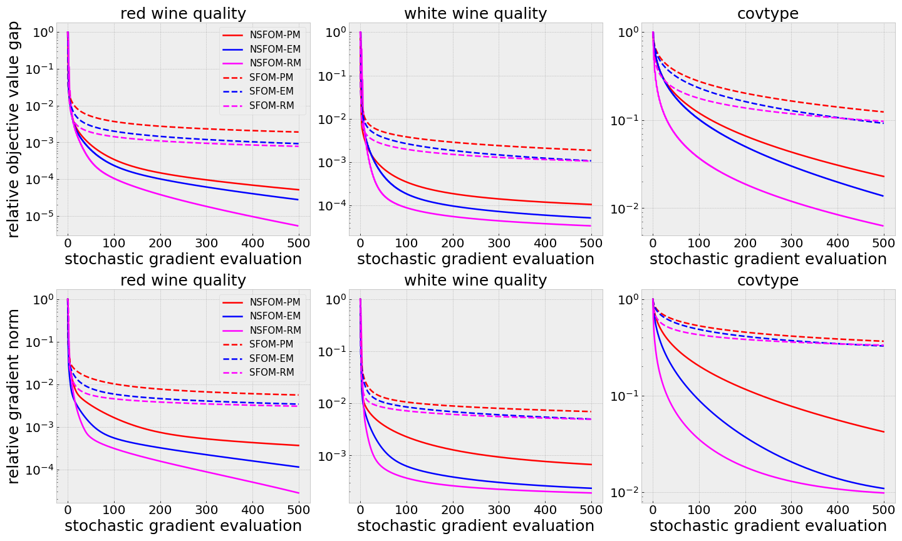
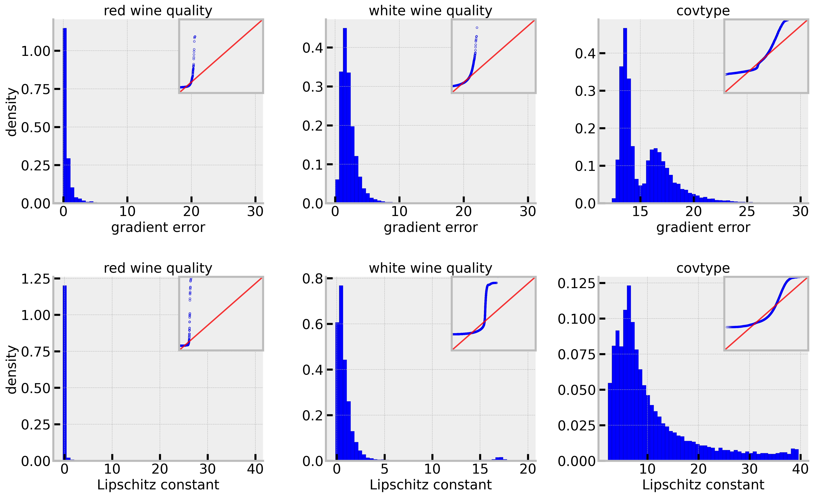
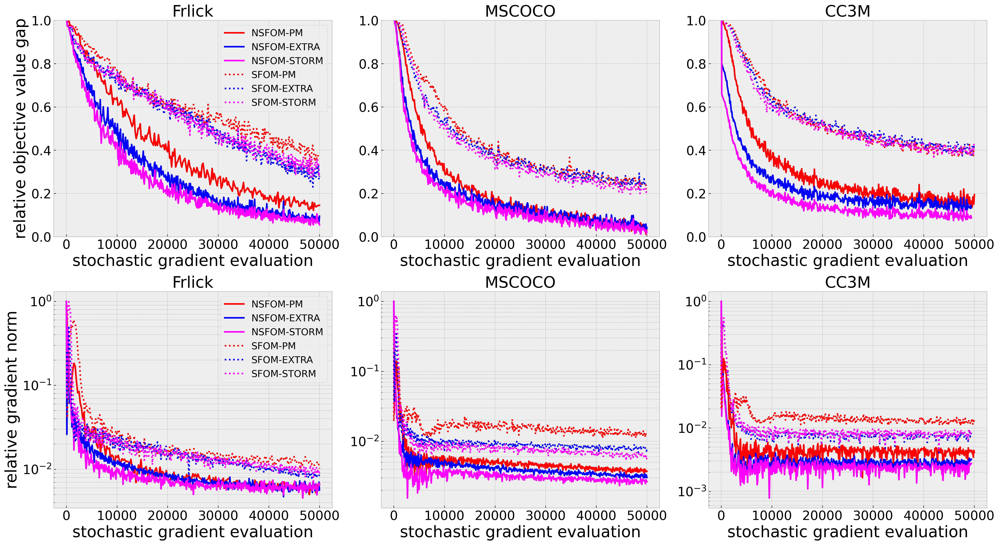
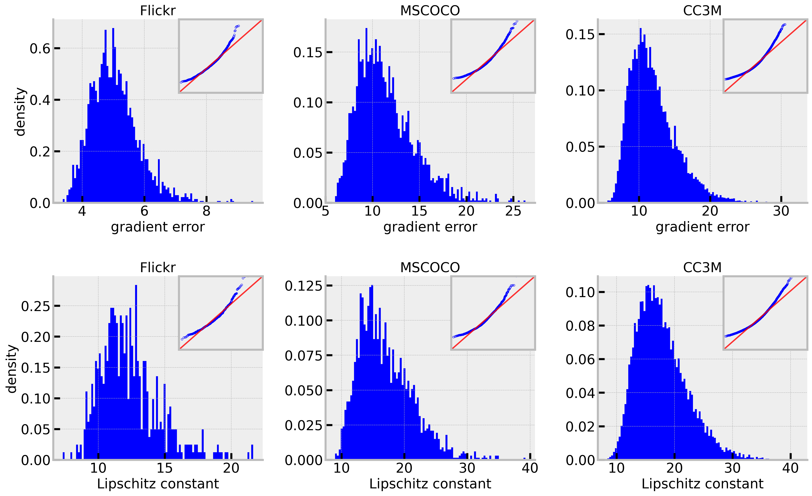

# Normalized stochastic first-order methods with momentum under heavy-tailed noise
This repository contains the implementation code for the paper "Complexity of normalized stochastic first-order methods with momentum under heavy-tailed noise".  The code implements stochastic interior-point methods with a focus on data fitting problem, robust regression problem, and neural network training with multimodal data.
## Project Overview

This repository contains two main components for the NSFOM-HT project:
1. `bimodal_exps/` - Bimodal experiments module
2. `regression/` - Regression analysis module

## Repository Structure

### bimodal_EXPS/
```
├── __pycache__/         # Python cache directory
├── dataset/             # Contains datasets for model training/testing
├── models/              # Machine learning model definitions and training code
├── optim/               # Optimization algorithms and strategies
├── scheduler/           # Task scheduling and planning code
├── clip_heavy.py        # Script for complex computations/processing
├── noise_test.py        # Script for noise-related testing
└── utils.py             # Utility functions and helper code
```

### regression/
```
├── data/                # Data files for regression analysis
├── result/              # Output directory for regression results
├── mem_reg.m            # Memory regression script
└── mem_roubst_reg.m     # Robust memory regression script
```

## Getting Started

### Prerequisites
 - Python 3.x (for bimodal_EXPS)
 - MATLAB (for regression scripts)


## How to Run the Code

### Data fitting problem:
$$
\min_{x\in\mathbb{R}^n}  f(x) = \sum_{i=1}^m \left\|s(a_i^Tx)-b_i\right\|^2,
$$

where $\phi(t)=t^2/(1+t^2)$ is a robust loss function \cite{carmon2017convex,he2023newton}, and $\{(a_i,b_i)\}_{1\le i\le m}\subset\mathbb{R}^n\times\mathbb{R}$ is the training set. 
1. Start MATLAB
2. Navigate to the repository root directory
3. Run the following command:
```matlab
run mem_reg.m
```

#### Results
<div style="display: flex; justify-content: space-around;">
  
</div>

<center>&nbsp;&nbsp;&nbsp;&nbsp;&nbsp;&nbsp;&nbsp;&nbsp;&nbsp;&nbsp;&nbsp;&nbsp;&nbsp;&nbsp;&nbsp; Convergence behavior of the relative objective value and relative gradient norm</center>


### Robust regression problem

$$
\min_{x\in\mathbb{R}^n}  f(x) = \sum_{i=1}^m \phi(a_i^Tx-b_i),
$$

where $\phi(t)=t^2/(1+t^2)$ is a robust loss function, and $\{(a_i,b_i)\}_{1\le i\le m}\subset\mathbb{R}^n\times\mathbb{R}$ is the training set. 
1. Start MATLAB
2. Navigate to the repository root directory
3. Execute either:
```matlab
run mem_roubst_reg.m
```

#### Results
<div style="display: flex; justify-content: space-around;">
  
</div>
<p style="text-align: center;">&nbsp;&nbsp;&nbsp;&nbsp;&nbsp;&nbsp;&nbsp;&nbsp;&nbsp;&nbsp;&nbsp;&nbsp;&nbsp;&nbsp;&nbsp; Convergence behavior of the relative objective value and relative gradient norm</p>
<br><br>

<div style="display: flex; justify-content: space-around;">
  
</div>
<p style="text-align: center;">&nbsp;&nbsp;&nbsp;&nbsp;&nbsp;&nbsp;&nbsp;&nbsp;&nbsp;&nbsp;&nbsp;&nbsp;&nbsp;&nbsp;&nbsp; Gradient error and Lipschitz constant of different datasets.</p>
<br><br>

### Neural network training with multimodal data:

The heavy tail noise pheromone has been widely proven in Natural Language processing. However, it is few discussed in multimodal model pretraining
In this subsection, we consider a neural network problem with multimodal data. Formally, during training, consider a batch of $ N $ image-caption pairs, $ \{(I_j, T_j)\}_{j=1}^N $, where $ I_j $ and $ T_j $ represent the raw image and text pair, respectively. The image embedding $ I_j \in \mathbb{R}^d $ and text embedding $ T_j \in \mathbb{R}^d $ are obtained by passing $ I_j $ and $ T_j $ through the image encoder $ f_I $ and text encoder $ f_T $, respectively; i.e.,
$I_j^e = f_{I_\theta}(I_j) \quad \text{and} \quad T_j^e = f_{T_\theta}(T_j).$


The contrastive objective in CLIP aims to align the image and text representations by minimizing the loss function $ \mathcal{L}_{\text{CLIP}} $ shown below:

$$
\mathcal{L}_{\text{CLIP}} = -\frac{1}{2N} \sum_{j=1}^{N} \left[ 
\log \frac{\exp \left( \langle I_j^e, T_j^e \rangle / \tau \right)}
{\sum\limits_{k=1}^{N} \exp \left( \langle I_j^e, T_k^e \rangle / \tau \right)} + \log \frac{\exp \left( \langle I_j^e, T_j^e \rangle / \tau \right)}
{\sum\limits_{k=1}^{N} \exp \left( \langle I_k^e, T_j^e \rangle / \tau \right)}
\right]
$$

where $\langle \cdot, \cdot \rangle$ represents the inner product, and $\tau$ is a trainable temperature parameter. 

1. Start MATLAB
2. Navigate to the repository root directory
3. Execute:
```bash
python clip_heavy.py  
```

#### Results
<div style="display: flex; justify-content: space-around;">
  
</div>
<p style="text-align: center;">&nbsp;&nbsp;&nbsp;&nbsp;&nbsp;&nbsp;&nbsp;&nbsp;&nbsp;&nbsp;&nbsp;&nbsp;&nbsp;&nbsp;&nbsp; Convergence behavior of the relative objective value and relative gradient norm</p>
<br><br>

<div style="display: flex; justify-content: space-around;">
  
</div>

<p style="text-align: center;">&nbsp;&nbsp;&nbsp;&nbsp;&nbsp;&nbsp;&nbsp;&nbsp;&nbsp;&nbsp;&nbsp;&nbsp;&nbsp;&nbsp;&nbsp; Gradient noise and Lipschitz constant of different datasets</p>
<br><br>

