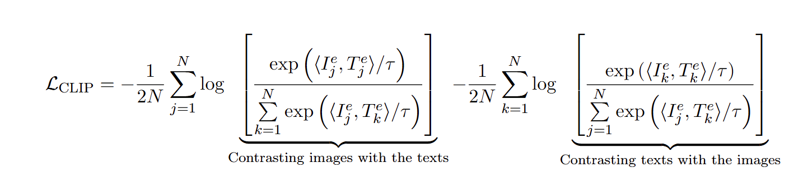

# Normalized stochastic first-order methods with momentum under heavy-tailed noise
This repository contains the implementation code for the paper "Complexity of normalized stochastic first-order methods with momentum under heavy-tailed noise".  The code implements stochastic interior-point methods with a focus on data fitting problem, robust regression problem, and neural network training with multimodal data.
## Project Overview

This repository contains two main components for the NSFOM-HT project:
1. `bimodal_exps/` - Bimodal experiments module
2. `regression/` - Regression analysis module

## Repository Structure

### bimodal_exps/
```
├── __pycache__/         # Python cache directory
├── dataset/             # Contains datasets for model training/testing
├── models/              # Machine learning model definitions and training code
├── optim/               # Optimization algorithms and strategies
├── scheduler/           # Task scheduling and planning code
├── clip_heavy.py        # Script for complex computations/processing
├── noise_test.py        # Script for noise-related testing
└── utils.py             # Utility functions and helper code
```

### regression/
```
├── data/                # Data files for regression analysis
├── result/              # Output directory for regression results
├── mem_reg.m            # Memory regression script
└── mem_roubst_reg.m     # Robust memory regression script
```

## Getting Started

### Prerequisites
 - Python 3.x 
 - MATLAB 


## How to Run the Code

### Data fitting problem:
$$
\min_{x\in\mathbb{R}^n}  f(x) = \sum_{i=1}^m \left\|s(a_i^Tx)-b_i\right\|^2,
$$

where $\phi(t)=t^2/(1+t^2)$ is a robust loss function, and $\{(a_i,b_i)\}_{1\le i\le m}\subset\mathbb{R}^n\times\mathbb{R}$ is the training set. 
1. Start MATLAB
2. Navigate to the repository root directory
3. Run the following command:
```matlab
run mem_reg.m
```

#### Results
<div style="display: flex; justify-content: space-around;">
  
</div>

<center>&nbsp;&nbsp;&nbsp;&nbsp;&nbsp;&nbsp;&nbsp;&nbsp;&nbsp;&nbsp;&nbsp;&nbsp;&nbsp;&nbsp;&nbsp; Convergence behavior of the relative objective value and relative gradient norm</center>


### Robust regression problem

$$
\min_{x\in\mathbb{R}^n}  f(x) = \sum_{i=1}^m \phi(a_i^Tx-b_i),
$$

where $\phi(t)=t^2/(1+t^2)$ is a robust loss function, and $\{(a_i,b_i)\}_{1\le i\le m}\subset\mathbb{R}^n\times\mathbb{R}$ is the training set. 
1. Start MATLAB
2. Navigate to the repository root directory
3. Execute either:
```matlab
run mem_roubst_reg.m
```

#### Results
<div style="display: flex; justify-content: space-around;">
  
</div>
<p style="text-align: center;">&nbsp;&nbsp;&nbsp;&nbsp;&nbsp;&nbsp;&nbsp;&nbsp;&nbsp;&nbsp;&nbsp;&nbsp;&nbsp;&nbsp;&nbsp; Convergence behavior of the relative objective value and relative gradient norm</p>
<br><br>

<div style="display: flex; justify-content: space-around;">
  
</div>
<p style="text-align: center;">&nbsp;&nbsp;&nbsp;&nbsp;&nbsp;&nbsp;&nbsp;&nbsp;&nbsp;&nbsp;&nbsp;&nbsp;&nbsp;&nbsp;&nbsp; Gradient error and Lipschitz constant of different datasets.</p>
<br><br>

### Neural network training with multimodal data:

The heavy tail noise phenomenon has been widely demonstrated in natural language processing, yet it remains under-explored in multimodal model pretraining. The contrastive objective used in CLIP aims to align image and text embeddings by minimizing the following loss function :

<div style="display: flex; justify-content: space-around;">
  
</div>


where $\langle \cdot, \cdot \rangle$ represents the inner product, and $\tau$ is a trainable temperature parameter. 

1. Start MATLAB
2. Navigate to the repository root directory
3. Execute:
```bash
python clip_heavy.py  
```

#### Results
<div style="display: flex; justify-content: space-around;">
  
</div>
<p style="text-align: center;">&nbsp;&nbsp;&nbsp;&nbsp;&nbsp;&nbsp;&nbsp;&nbsp;&nbsp;&nbsp;&nbsp;&nbsp;&nbsp;&nbsp;&nbsp; Convergence behavior of the relative objective value and relative gradient norm</p>
<br><br>

<div style="display: flex; justify-content: space-around;">
  
</div>

<p style="text-align: center;">&nbsp;&nbsp;&nbsp;&nbsp;&nbsp;&nbsp;&nbsp;&nbsp;&nbsp;&nbsp;&nbsp;&nbsp;&nbsp;&nbsp;&nbsp; Gradient noise and Lipschitz constant of different datasets</p>
<br><br>

